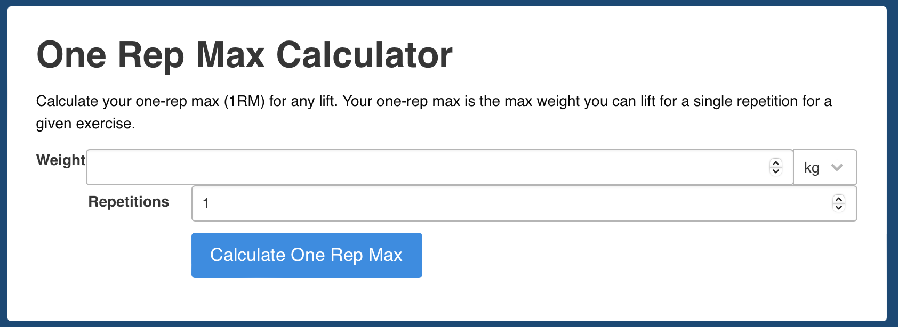
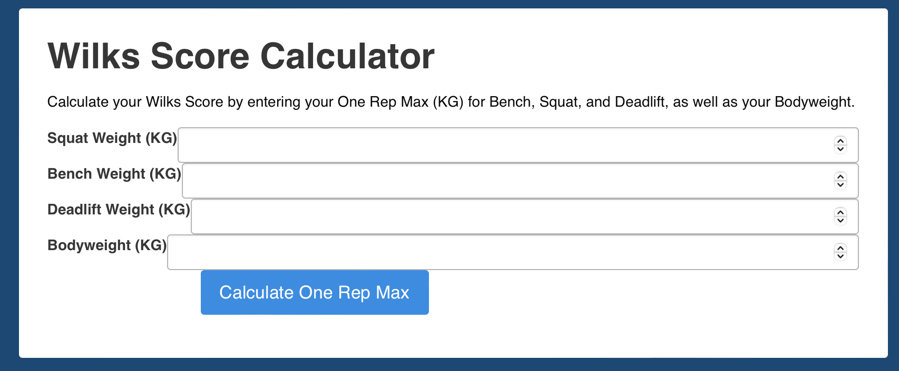
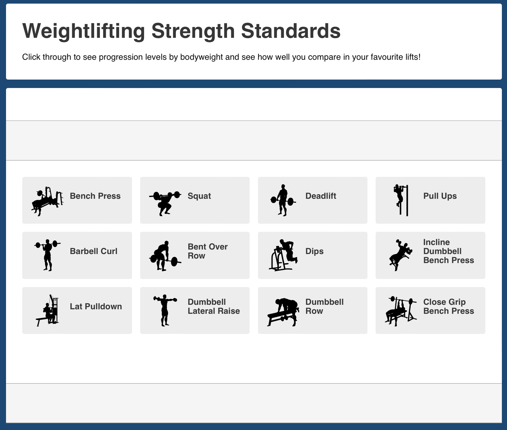

# Strength Level Clone 

## Functionality
This project was built as part of the University of Edinburgh - HyperionDev course
on software engineering and web development, wherein I built a Django project.

The Django project is a functional clone of StrengthLevel.com, a well-built website with very useful training tools, a few of which I was able to replicate.

## Usage / User's Guide

There are five functional aspects of the Strength Level clone:
1. A One Rep Max Calculator

2. A Wilks Score Calculator

3. Nine (of twelve) strength standards for different exercises

4. A training log to enter what you did in your workout for the day
5. A fully operational login system
6. And a fully operational registration system

## Installation

1. Install Docker on your system.
2. Clone the repository.
3. Replace StrengthStandards/settings.py line 23 with: "django-insecure-80!lgf185d=kbw^+@+t=ufb+9(=qn-m@4!yo^tic&*j7n_7&3-"
4. Build the Docker image by running the following command in the repository directory:

> docker build -t strengthstandards .

5. Run the Docker container by running the following command:

> docker run -p 8000:8000 strengthstandards

6. Alternatively you can skip step 4 and enter the following command:

> python manage.py runserver

7. Note -- The superuser and password is:

> Username: thomas
> Password: password

## License and rights

All credit and rights go to StrengthLevel.com --
Anything distinctive to their website belongs fully to them. This project was built under Fair Use for educational purposes and not for financial gain.
